# Dignity Tracker user guide

The Dignity Tracker at [dignity-tracker.onrender.com](https://dignity-tracker.onrender.com) is where Phoenix Dignity Project tracks care package requests, delivery volunteers, packing and Tempe Feed booth requests in one place. Screenshots use made-up sample people.

## Getting started

Everyone signs in with their name or phone number and a PIN of at least 4 digits. There are two kinds of accounts.

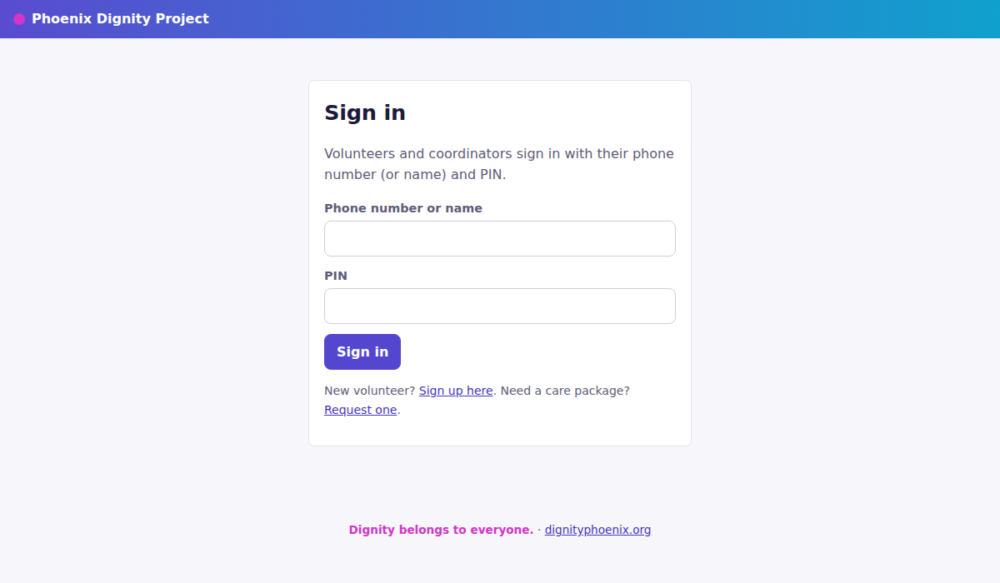

| Account | What they can do |
| --- | --- |
| Volunteer | Claim deliveries on the map, sign up for packing shifts, log booth requests, see inventory |
| Coordinator | Everything a volunteer can, plus manage care packages, send messages, approve volunteers, download the Excel file and change settings |

**New volunteers** sign up at [dignity-tracker.onrender.com/join](https://dignity-tracker.onrender.com/join). Their account stays pending until a coordinator approves it on the **Volunteers** page.

**Changing your PIN:** click your name at the top right (**My account**).

**The menu** across the top:

- **Home**: your deliveries, your packing shifts, what's due at the next Tempe Feed, and items running low.
- **Delivery map**: open deliveries to pick from.
- **Packing**: packing shifts to sign up for.
- **Tempe Feed booth**: the booth request board.
- **Inventory**: what's on the shelf and the shopping list.
- **Care packages**, **Messages**, **Volunteers**, **Excel**: coordinators only.

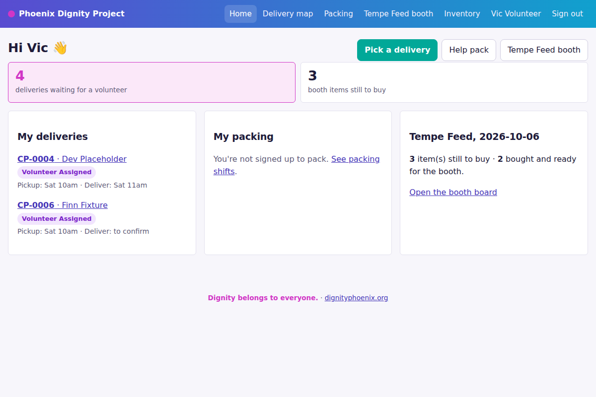

People asking for help can also use the public request form at [dignity-tracker.onrender.com/request](https://dignity-tracker.onrender.com/request). They don't need an account.

## Care packages (coordinators)

Every request from the Google Form or the website appears on the **Care packages** page by itself. Nobody needs to import anything. Each request moves through these statuses:

1. **New**: just arrived.
2. **Texted - No Response**: you messaged them and are waiting to hear back.
3. **Too Early to Pack**: not ready yet, for example a delivery date weeks away.
4. **Ready for Volunteer**: confirmed, and now shown on the delivery map for volunteers to claim.
5. **Volunteer Assigned**: a volunteer has taken it.
6. **Packed & Ready**: the box is packed.
7. **Picked Up**: the volunteer has collected it and is on the way.
8. **Delivered**: done.

**Changing a request from its row.** Each row on the Care packages page has its own controls, and changes save the moment you make them:

- the **status** dropdown;
- the **Volunteer** dropdown (picking someone moves it to Volunteer Assigned; clearing it puts it back on the map);
- **Printed** and **Connected** tick boxes (label printed, WhatsApp group made);
- **Text** and **Label** buttons.

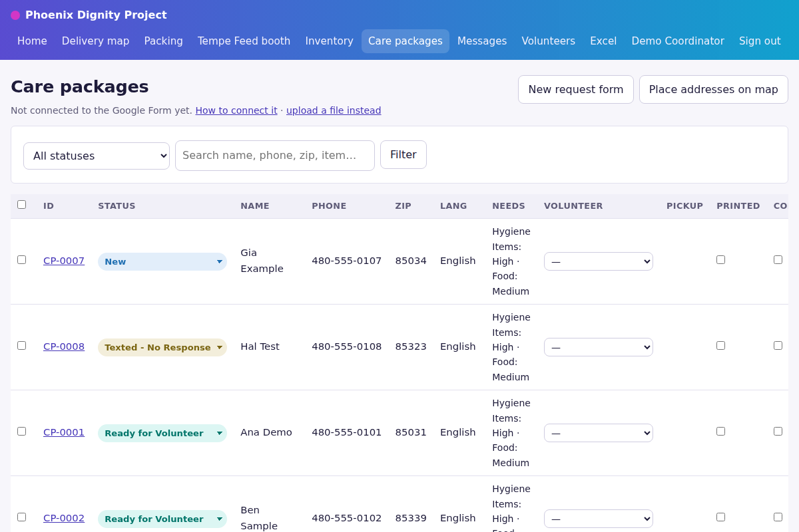

**Changing many at once.** Tick the boxes at the left of several rows. A bar appears at the bottom of the screen to change all of them together.

**Opening a request** (click its ID) shows everything they asked for, the packing list, every Google Form answer and the **Edit** box for names, phones, addresses and notes.

**Not on the map yet?** The site places addresses on the map by itself. If one won't place, check the address has a street number, city and zip, then press **Place addresses on the map**.

## Delivery map (volunteers)

The **Delivery map** shows every delivery waiting for a volunteer as a numbered pin, with the same numbers in the list beside it. Before you claim one, you only see the street and zip; the house number and phone appear once it's yours.

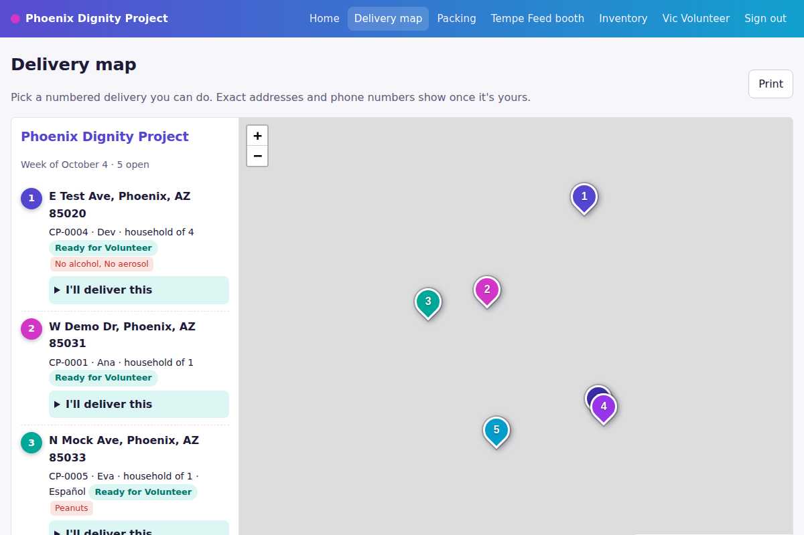

1. Pick a numbered delivery you can do and press **I'll deliver this**.
2. Say when you can pick it up from HQ and when you'll deliver, then press **Claim delivery**.
3. It now shows on your **Home** page under My deliveries, with the full address and a **Directions** link.
4. When you collect the box, open the delivery and press **I picked it up**.
5. After dropping it off, press **Mark delivered**.

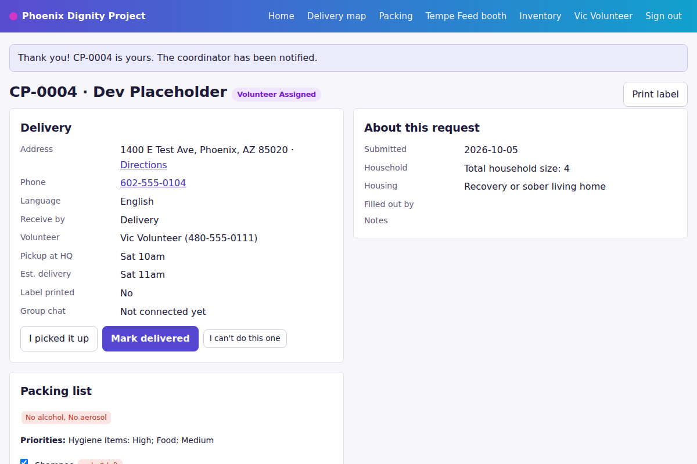

Can't do it after all? Press **I can't do this one** on the delivery page. It goes back on the map for someone else.

Coordinators can press **Share list to WhatsApp** on the map to post this week's open deliveries to the volunteer group.

## Packing and inventory

**Packing shifts.** On the **Packing** page, pick a shift, tick the packages you'll pack and press **Sign me up**. Press **I can't make it** to drop out. Coordinators add shifts at the bottom of the same page (date, time, place, number of spots).

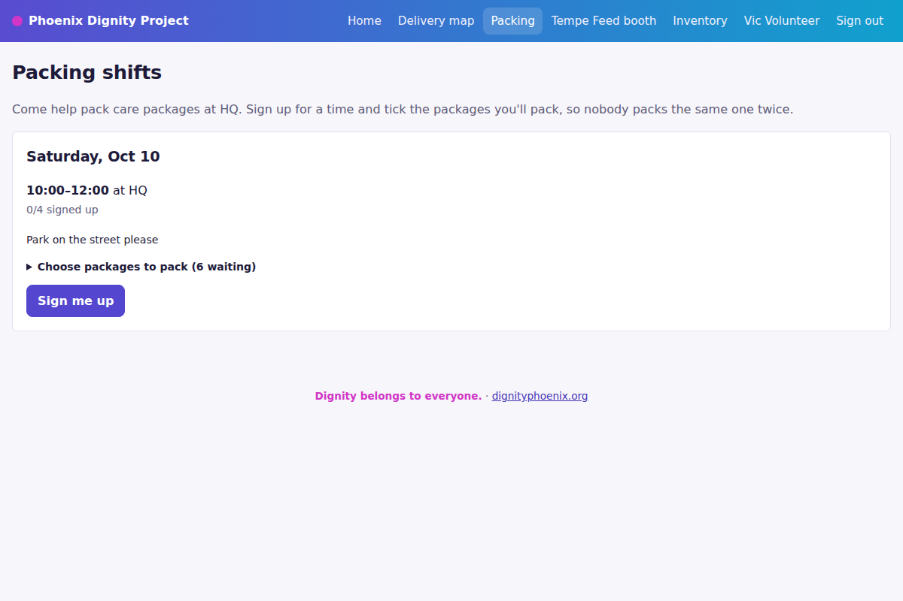

**Packing a box.** Open the package. Its **Packing list** shows each item to pack, already matched to what's on the shelf. Items that aren't safe for that person are flagged in red, for example aerosols or alcohol for a sober-living home, or a food allergy. Tick what you packed and press **Mark packed**. Those items come off the inventory count once, and the package moves to Packed & Ready.

**Inventory.** The **Inventory** page shows what's on the shelf and a **Shopping list** of what the open requests need but you don't have enough of. Anything below its low level also shows there. Coordinators update counts and add new items on the same page.

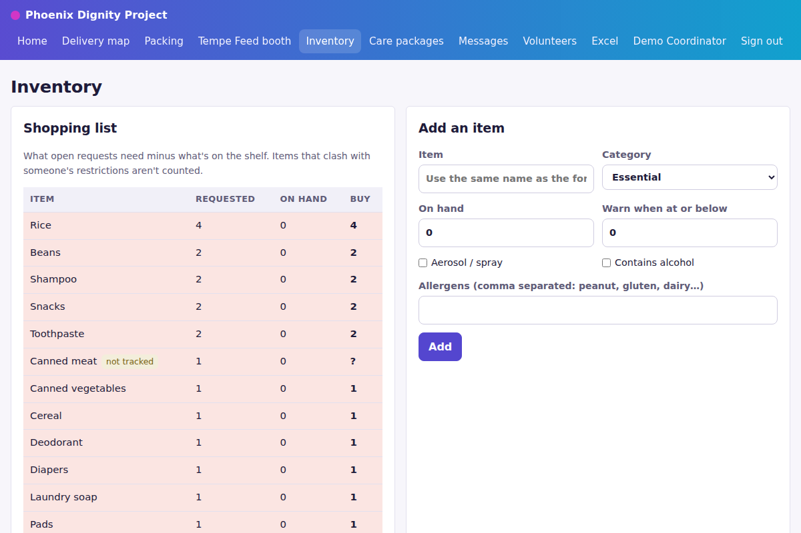

## Tempe Feed booth

Tempe Feed happens every Tuesday. When someone at the booth asks for something (shoes, a jacket, a backpack), log it on the **Tempe Feed booth** page under **New request at the booth**: their name, phone and each item with its size. The site records the date you entered it. Press **+ another item** for more than one.

Each item is a card on the board, and moves across these columns:

1. **Requested**: someone needs to buy it.
2. **Bought**: pressing **Bought →** also drafts a text telling the person it's coming.
3. **At Booth**: it's on the table at Tempe Feed, waiting to be collected.
4. **Picked Up**: the person took it home.

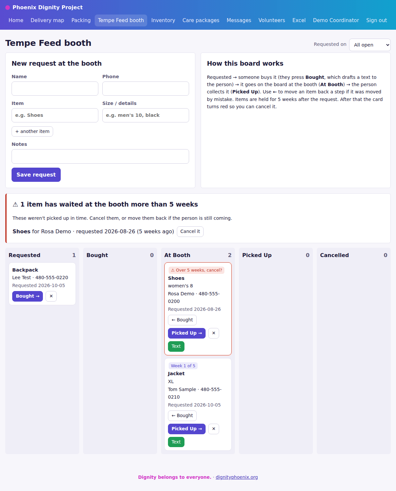

Press the **← button** on a card to move it back a step if it was moved by mistake. Press **✕** to cancel an item, and **← Restore** to bring a cancelled one back.

**The 5-week hold.** Items are held for 5 weeks after the request. Cards at the booth show **Week 1 of 5**, **Week 2 of 5** and so on. After 5 weeks the card turns red with **Over 5 weeks, cancel?**, and a box at the top of the page lists every overdue item with a **Cancel it** button. Nothing is cancelled automatically, so a coordinator or volunteer decides.

**Many people at once.** Several volunteers can log requests at the same time during the event; nothing gets lost. The board picks up everyone else's changes every 10 seconds. If you're in the middle of typing a request, it waits and shows a **Refresh** notice instead, so your typing isn't lost.

The board shows every open item. To see only the requests entered on one day, pick it from the **Requested on** dropdown at the top.

## Messages (coordinators)

The site never sends a message by itself. It writes the message for you, and you send it from your own phone.

**Drafted for you** when:

- a volunteer is assigned (an introduction to the requester naming the volunteer and the address);
- a volunteer picks up the box ("on the way");
- a package is delivered (a thank-you);
- a booth item is bought ("it's ready at Tempe Feed").

Spanish speakers get the Spanish version automatically.

**Sending them.** Open **Messages**. It has two tabs, **Care packages** and **Tempe Feed booth**. Press **WhatsApp** or **Text** to open your phone's app with the message filled in, send it, then press **Mark sent** (or **Mark skipped** if you didn't need it). **Show all** brings back ones already handled.

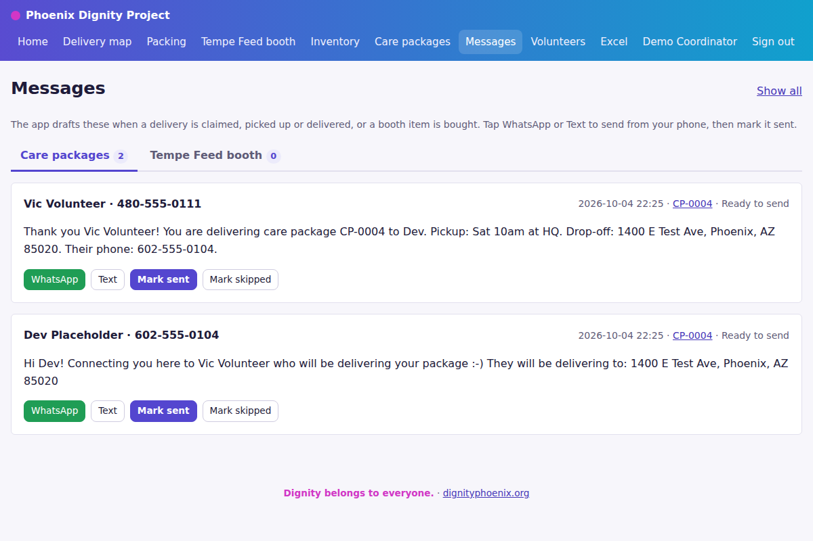

You can also message someone at any time from their request page (the **Coordinate** box) or the **Text** button on their row or booth card. The message there always matches where their request stands.

**Changing the wording.** Go to **Excel**, scroll to **Settings**, edit any message starting with "msg" and press **Save settings**. Words in curly brackets like {name}, {volunteer} and {address} are filled in for each person, so keep them.

## Google Form and Excel

The Google Sheet behind the care package form and the website keep each other up to date every 5 minutes, and right away when someone submits the form. You can work in either one.

| Change made in | Goes to | What travels |
| --- | --- | --- |
| Google Form | Website | Every new request |
| Google Sheet | Website | Edited answers (address, items, name, phone) and the Tracker Status, Volunteer, Pickup and Delivered columns |
| Website | Google Sheet | Status, volunteer, pickup and delivery in the Tracker columns; name, phone and address edits; requests made on the website form |

**In the sheet:** don't rename the columns that start with "Tracker". To see a change on the site straight away, use the **Tracker** menu, **Sync now**.

**The Excel file.** Everything on the site is kept in one Excel workbook. Coordinators can download it from the **Excel** page at any time, as a backup or for reports. If you edit the downloaded file, upload it on the same page to replace the site's copy. Only do this when nobody else is making changes, because the upload replaces everything.

## Coordinator tasks and common questions

**Volunteers page.** Press **Approve** for new sign-ups. You can also make someone a coordinator, switch a volunteer off when they stop helping, set a new PIN for someone who forgot theirs, or add a volunteer yourself.

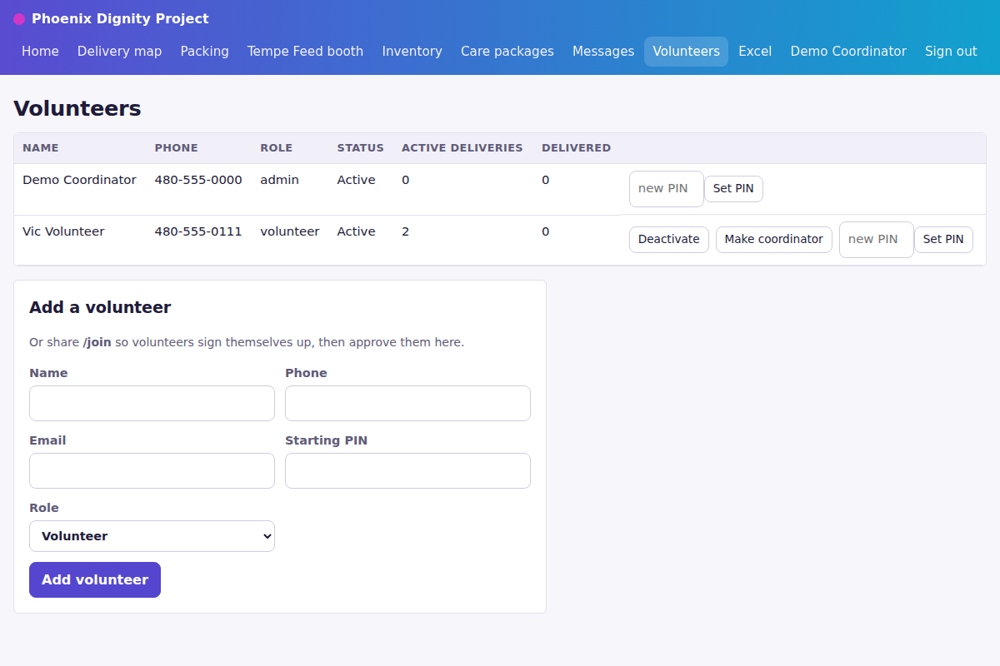

**Settings** (bottom of the **Excel** page) hold the organization name, HQ address, booth day, message wording and similar options. Each one says what it does.

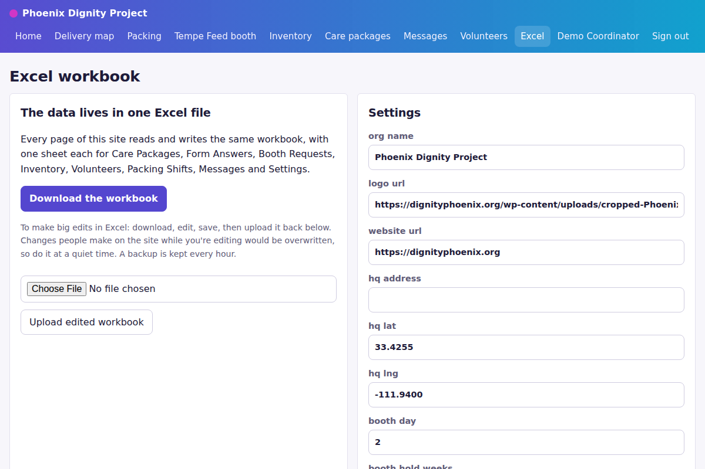

**Someone forgot their PIN.** A coordinator sets a new one on the Volunteers page and tells them.

**A request is missing from the site.** Open the Google Sheet and use **Tracker**, **Sync now**. The site checks the sheet every 5 minutes anyway.

**I changed something in the sheet and the site didn't update.** Run **Sync now**, then refresh the website page. If it still hasn't changed, tell Harini.

**Someone's details are private.** Volunteers only see a requester's full address and phone after they claim the delivery. Please don't share the Excel file or screenshots of request pages outside the team.
